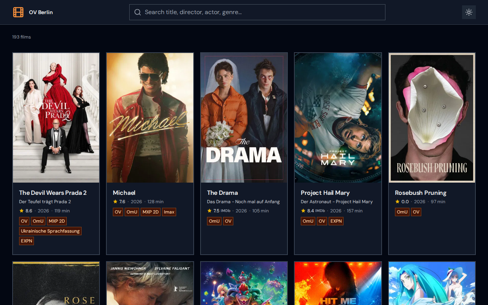
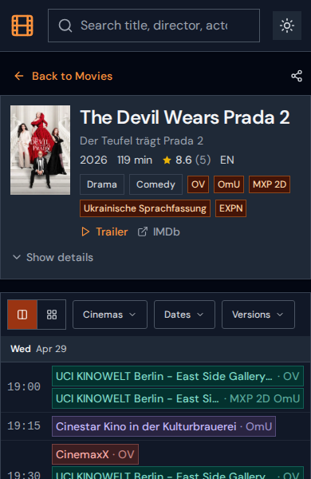
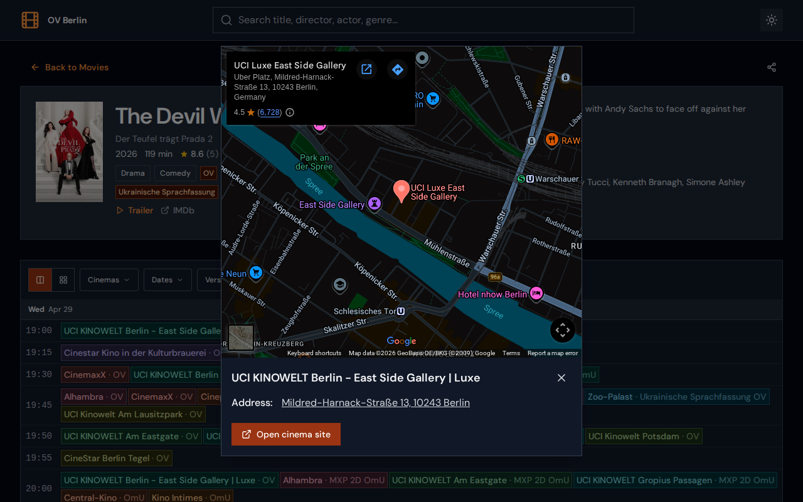
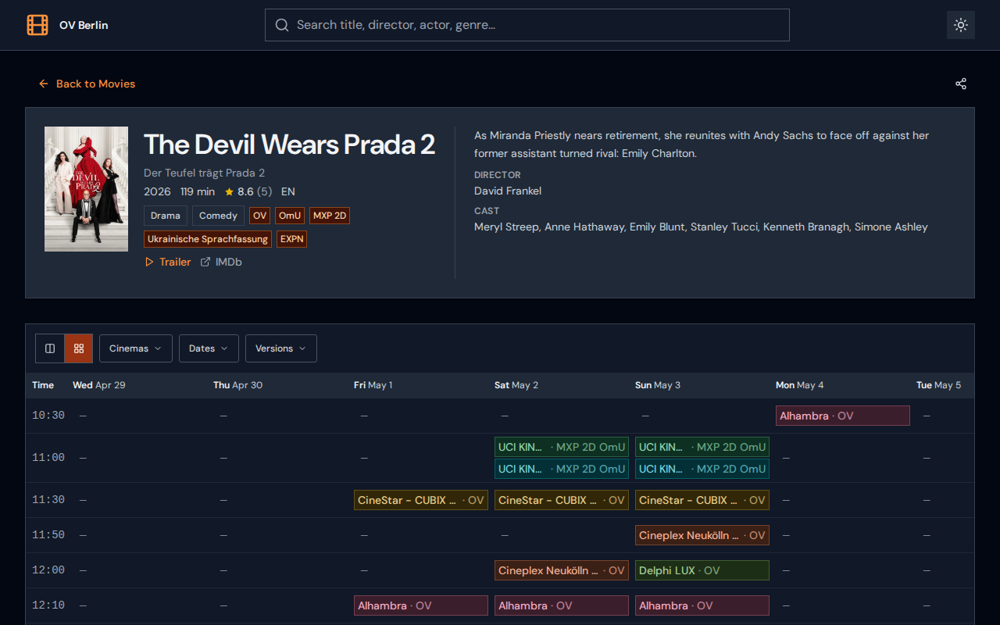

# Berlin OV Cinema

Browse original version (OV) movies playing in Berlin cinemas, with showtimes by date and cinema.

Live at **[ovberlin.site](https://ovberlin.site)**

## Screenshots

| Movie listing | Search results |
|---|---|
|  |  |

| Movie detail — stacked view | Movie detail — grid view |
|---|---|
|  |  |

## How it works

The app is fully static — no server, no API at runtime.

A GitHub Actions workflow runs every 6 hours. It scrapes [critic.de](https://www.critic.de/ov-movies-berlin/) using Cheerio, writes the result to `public/movies.json`, builds the React app, and deploys to GitHub Pages. The frontend fetches that JSON file directly.

Each deploy bakes a unique build ID into the JS bundle, which is used as a cache-busting query param (`/movies.json?v=<id>`), so users always get fresh data after a redeploy.
## Stack

- **React 19** + **TypeScript** + **Vite**
- **Tailwind CSS** + **Lucide React**
- **Cheerio** for scraping (runs at build time only)
- **GitHub Actions** for cron scheduling and deployment
- **GitHub Pages** for hosting

## Local development

```bash
npm install
npm run dev      # scrapes live data, writes public/movies.json, starts Vite at localhost:3000
```

If you want to refresh the local dataset without starting the app, run:

```bash
npm run scrape
```

### TMDb enrichment (optional)

To fetch movie posters and details from TMDb during local scraping, copy `.env.example` to `.env` and add your free TMDb API key:

```bash
cp .env.example .env
# Edit .env and replace the placeholder with your key from https://www.themoviedb.org/settings/api
```

Without a key, the scraper skips enrichment and falls back to the basic data from critic.de.

To preview the production build locally:

```bash
npm run preview  # scrape + build + vite preview
```

## Project structure

```
api/                      # Scraper modules (Node/TypeScript, build-time only)
  berlin-cinema-scraper.ts
  http-client.ts
  movie-parser.ts
  movie-merger.ts
  form-data-builder.ts
scripts/
  scrape.ts               # Entry point: runs scraper, writes public/movies.json
src/
  pages/
    HomePage.tsx          # Movie listing with search and filters
    MovieDetailPage.tsx   # Showtimes table (grid + stacked view, PNG export)
    CinemaPage.tsx        # Movies filtered by cinema
  services/api.ts         # Fetches /movies.json
  types/index.ts
.github/workflows/
  deploy.yml              # Cron (4am UTC), push, and manual trigger
```
