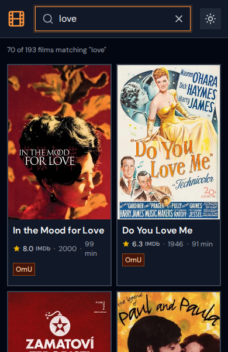

# OV Berlin

Browse original version (OV) movies playing in Berlin cinemas, with showtimes, ratings, and cinema info.

Live at **[ovberlin.site](https://ovberlin.site)**

| | |
|---|---|
|  |  |
|  |   |

## Features

- **Fuzzy search** across title, director, cast, genres, and plot
- **Rich movie details** — poster, plot, runtime, age rating, trailer link
- **Ratings** — IMDb rating with Rotten Tomatoes and Metacritic on hover/tap
- **Showtimes** in stacked (by date) and grid (by cinema) layouts, with filters by cinema, date, and format (OV/OmU/etc.)
- **Cinema info** — Google Maps embed and website link when you tap a cinema
- **Share** — each movie has a unique URL with rich link previews on WhatsApp and social media
- **Dark / light theme**
- **PWA** — installable, works offline after first load

## How it works

Data is refreshed automatically every 6 hours. A scheduled job scrapes current OV listings from [critic.de](https://www.critic.de/ov-movies-berlin/), enriches each movie with metadata, posters, and ratings from TMDb and OMDb, then deploys the result as a fully static site on GitHub Pages. There is no server — the frontend loads a single JSON file.

## Stack

- **React 19** + **TypeScript** + **Vite**
- **Tailwind CSS** + **Fuse.js** + **Cheerio**
- **TMDb API** — metadata, posters, trailers
- **OMDb API** — IMDb / Rotten Tomatoes / Metacritic ratings
- **OpenStreetMap** — cinema website URLs
- **GitHub Actions** + **GitHub Pages**
