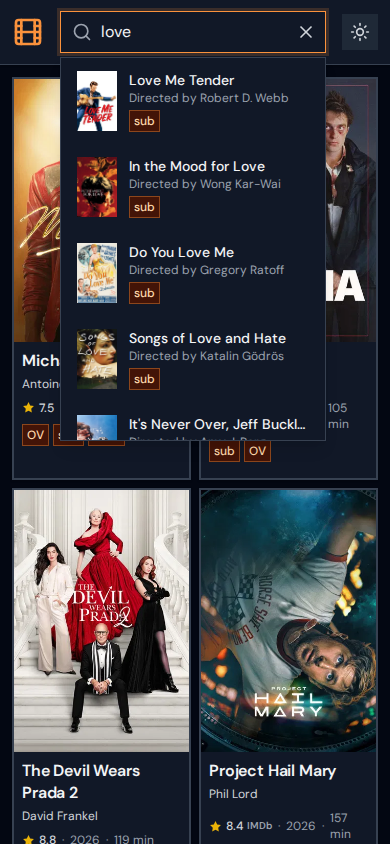

# OV Berlin

Browse original version (OV) movies playing in Berlin cinemas, with showtimes, ratings, and cinema info.

Live at **[ovberlin.site](https://ovberlin.site)**

## Screenshots

| | |
|---|---|
|  |  |
|  |   |

## Features

- **Fuzzy search** across title, director, cast, genres, plot, and keywords (Fuse.js)
- **Rich movie details** — poster, backdrop, plot, runtime, age rating, trailer link
- **Ratings** — IMDb rating (via OMDb) with Rotten Tomatoes and Metacritic on hover/tap; falls back to TMDb rating
- **Showtimes** in two layouts: stacked (by date) and grid (by cinema), with filters by cinema, date, and variant (OV/OmU/etc.)
- **Cinema popup** — Google Maps embed (dark mode aware) + website link from OpenStreetMap
- **Share button** — Web Share API on mobile, clipboard fallback on desktop; each movie has a unique URL with baked-in OG tags for rich link previews on WhatsApp/social
- **Dark / light theme** toggle
- **PWA** — installable, works offline after first load

## How it works

The app is fully static — no server, no API at runtime.

A GitHub Actions workflow runs every 6 hours:

1. **Scrape** — fetches current OV listings from [critic.de](https://www.critic.de/ov-movies-berlin/) via Cheerio
2. **Enrich** — looks up each movie on TMDb (posters, plot, cast, trailer, genres, IMDb ID); cached per title via `tmdbFetched` flag
3. **Ratings** — fetches fresh IMDb/RT/Metacritic scores from OMDb for every movie with an IMDb ID (no cache — ratings change)
4. **Cinema data** — fetches website URLs from OpenStreetMap Overpass API; cached per cinema name. Map embeds use the cinema name directly via Google Maps
5. **Build** — Vite bundles the React app; a post-build script generates per-movie `index.html` files with OG meta tags baked in for social crawlers
6. **Deploy** — uploads `dist/` to GitHub Pages

The frontend fetches `movies.json` directly (cache-busted by build ID).

## Stack

- **React 19** + **TypeScript** + **Vite**
- **Tailwind CSS** + **Lucide React**
- **Cheerio** — HTML scraping at build time
- **Fuse.js** — client-side fuzzy search
- **Playwright** — automated README screenshots
- **TMDb API** — movie metadata, posters, trailers
- **OMDb API** — IMDb / Rotten Tomatoes / Metacritic ratings
- **OpenStreetMap** — cinema website URLs (Overpass) and geocoding (Nominatim)
- **GitHub Actions** — cron scheduling and deployment
- **GitHub Pages** — hosting

## Local development

```bash
npm install
npm run dev      # scrape → write public/movies.json → start Vite at localhost:5173
```

To refresh data without starting the app:

```bash
npm run scrape
npm run scrape:force   # re-fetches TMDb data even if already cached
```

### API keys (optional)

Without keys the scraper still works — it just skips enrichment and ratings. Copy `.env.example` to `.env` and fill in your keys:

```bash
cp .env.example .env
```

| Key | Where to get it | What it unlocks |
|---|---|---|
| `TMDB_API_KEY` | [themoviedb.org/settings/api](https://www.themoviedb.org/settings/api) | Posters, plot, cast, genres, trailer, IMDb ID |
| `OMDB_API_KEY` | [omdbapi.com/apikey.aspx](https://www.omdbapi.com/apikey.aspx) | IMDb / RT / Metacritic ratings |

Both keys also need to be added as GitHub Actions secrets (`TMDB_API_KEY`, `OMDB_API_KEY`) for the CI deploy to enrich movies.

### Preview production build

```bash
npm run preview   # build + vite preview at localhost:4173
```

### Update screenshots

```bash
npm run screenshots          # captures from ovberlin.site (after deploy)
npm run screenshots:local    # captures from localhost:4173 (run preview first)
```

## Project structure

```
api/
  berlin-cinema-scraper.ts   # Scrapes critic.de for OV listings
  tmdb-client.ts             # TMDb API — metadata, posters, trailers
  omdb-client.ts             # OMDb API — IMDb / RT / Metacritic ratings
  osm-client.ts              # OpenStreetMap — cinema websites + geocoding
scripts/
  scrape.ts                  # Entry point: scrape → enrich → write public/movies.json
  generate-og-pages.ts       # Post-build: bake OG tags into per-movie index.html
  screenshot.ts              # Playwright: capture docs/ screenshots
src/
  pages/
    HomePage.tsx             # Movie grid with fuzzy search
    MovieDetailPage.tsx      # Showtimes table (stacked + grid), filters, share
  components/
    CinemaPopup.tsx          # Map embed + website link popup
    MovieHeader.tsx          # Poster, metadata, ratings, trailer
    ShowtimesTable.tsx       # Toolbar + stacked/grid layout switcher
    FiltersPanel.tsx         # Cinema / date / variant filters
    SearchBar.tsx            # Fuzzy search with autocomplete
    ui/RatingBadge.tsx       # IMDb rating with RT/Metacritic tooltip
  contexts/
    MovieContext.tsx          # Fetches and caches movies.json
    ThemeContext.tsx          # Dark / light theme
  utils/
    movieSearch.ts           # Fuse.js index configuration
.github/workflows/
  deploy.yml                 # Cron (every 6h), push trigger, manual dispatch
```
